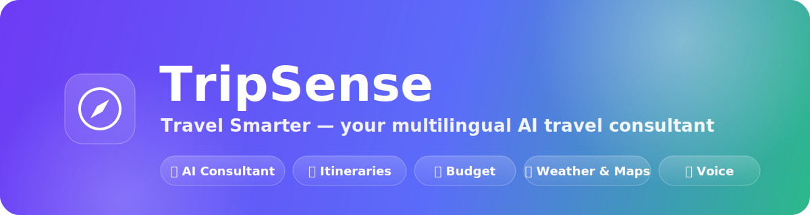
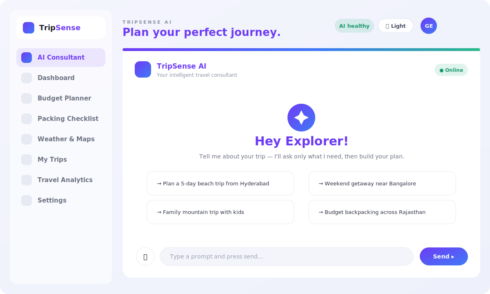
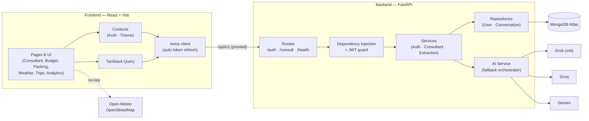
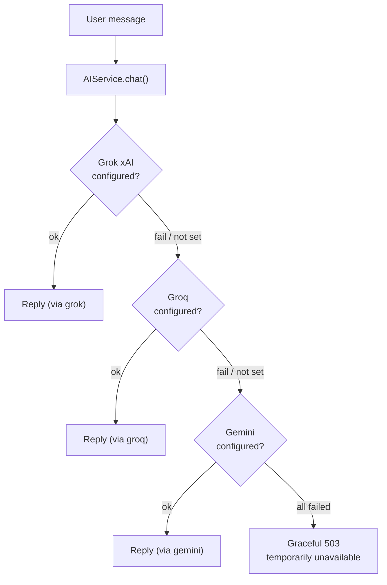
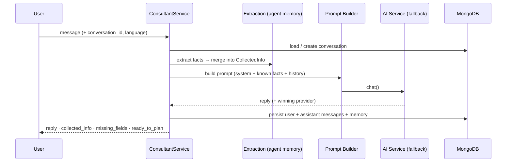
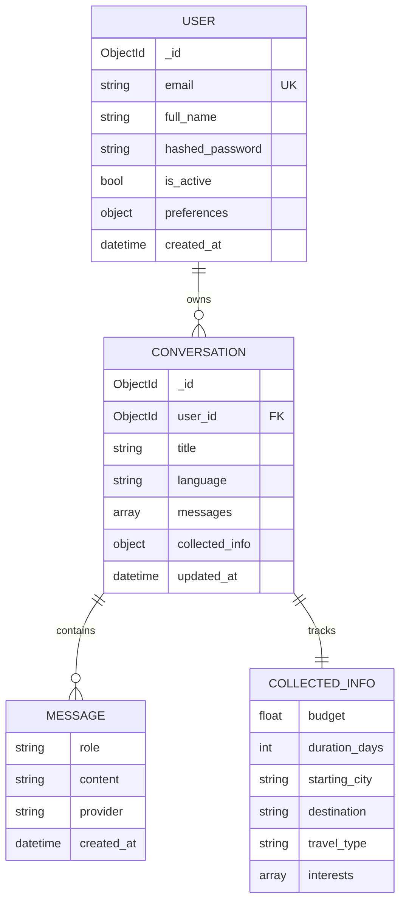
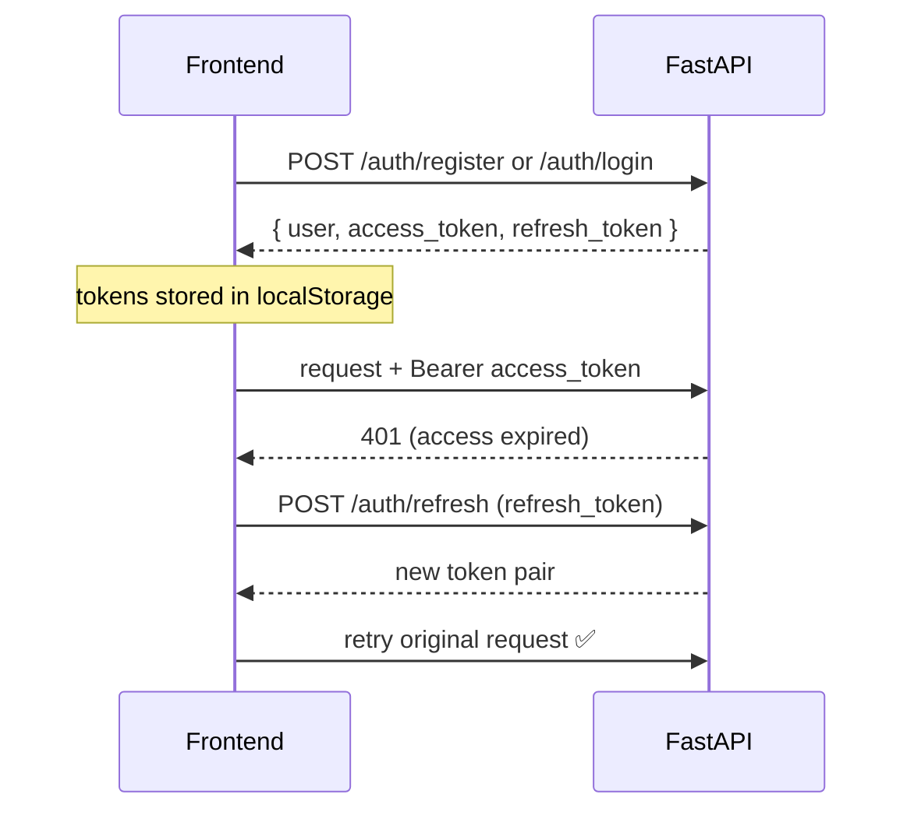

<p align="center">
  
</p>

<h1 align="center">TripSense ✈️</h1>

<p align="center">
  <strong>An AI-powered, multilingual travel-planning platform.</strong><br/>
  The AI travel consultant is one premium feature inside a polished SaaS product — <em>not</em> a chatbot.
</p>

<p align="center">
  
  
  
  
  
  
  
  
</p>

<p align="center">
  <a href="#-features">Features</a> ·
  <a href="#-tech-stack">Tech Stack</a> ·
  <a href="#-architecture">Architecture</a> ·
  <a href="#-the-ai-engine">AI Engine</a> ·
  <a href="#-getting-started">Getting Started</a> ·
  <a href="#-api-reference">API</a> ·
  <a href="#-roadmap">Roadmap</a>
</p>

---

## ✨ Overview

**TripSense** helps travellers plan complete trips through a warm, human-like AI consultant that
remembers context, asks only what it still needs, and proactively builds a plan. Around that AI sits a
full product: budget planning, packing checklists, weather & maps, saved trips, analytics, and settings —
all wrapped in a premium, responsive, dark/light UI.

| | |
| --- | --- |
| 🤖 **Agentic AI consultant** | Remembers the conversation, extracts trip facts, stops re-asking, plans like a human. |
| 🌍 **Multilingual** | English · Hindi · Telugu — with a future-ready architecture for more. |
| 🎙️ **Voice** | Speak to it (speech-to-text) and it speaks back (text-to-speech). |
| 🔁 **Seamless AI failover** | Grok → Groq → Gemini. If one provider fails, the next answers — the user never sees an error. |
| 🧭 **Guest mode** | Explore instantly — no forced signup. Create an account later to keep your trips. |
| 🎨 **Premium UI/UX** | Glassmorphism, gradients, micro-interactions, dark/light, fully responsive. |
| 🛡️ **Production-minded backend** | Clean architecture, JWT + refresh, resilient MongoDB with auto-reconnect, tests. |

---

## 🚀 Features

### 🤖 AI Travel Consultant *(the centrepiece)*
- **Agentic memory** — remembers previous messages and the structured facts already collected.
- **Never re-asks** — tracks known vs. missing details; asks at most one friendly question at a time.
- **Human-like planner** — reacts warmly, recommends *specific* places (with a hidden gem or food spot),
  explains the "why", and starts planning the moment it has enough.
- **Live "Trip details" panel** — budget, duration, origin, destination, travel type, and interests fill
  in automatically with a readiness progress bar.
- **Provider transparency** — each reply shows which model answered (`via groq` / `via gemini`).
- **Voice mode** — 🎙️ mic dictation (speech-to-text, auto-send) + 🔊 spoken replies (text-to-speech),
  language-matched, with an on/off toggle.
- **Save to trips** — once a plan is ready, save it with one click.
- Collects: budget, duration, starting city, destination, travel type, group size, interests, food &
  transport preferences, luxury level, children/seniors, medical needs, adventure level, accessibility.

### 💰 Smart Budget Planner
- Editable category sliders — Transport, Hotels, Food, Activities, Shopping, Emergency, Miscellaneous.
- **Recharts donut** breakdown, live **allocated vs. remaining** budget, per-category percentages.
- Dynamic **savings suggestions** that react to how you split the money.

### 🎒 Personalized Packing Checklist
- Generates a tailored list from **trip type** (beach / mountains / city / business / adventure),
  **duration**, and conditions (**children, seniors, traveling as a woman**).
- Tick items off with a **live progress bar**; reset anytime.

### 🌦️ Weather & Maps
- Search any city → **current conditions**, **7-day forecast**, humidity & wind.
- **Weather-aware travel advice** (rain, heat, cold).
- **OpenStreetMap** location map embed.
- Powered by free **Open-Meteo** — no API key required.

### 🗺️ My Trips · Saved Trips · Analytics
- **My Trips** — save plans from the consultant; **rename, favorite, duplicate, delete**.
- **Saved Trips** — your favorited trips in one place.
- **Travel Analytics** — stat tiles (trips, avg budget, total days, favorites), a **budget-by-trip bar
  chart**, and your **top interests**.

### 🔐 Authentication & Guest Mode
- **JWT access + refresh tokens**, bcrypt-hashed passwords, protected routes.
- **Transparent token refresh** — a single shared refresh on `401`, then the request auto-retries.
- **Guest mode** — jump straight in; a throwaway account is created so the AI and persistence work
  immediately, with a gentle nudge to upgrade.

### ⚙️ Settings
- Light / dark **theme**, preferred **language**, **voice** toggle, account details, and **live AI model
  status**.

### 🎨 Design System & UX
- Semantic **HSL design tokens** (light + dark), **glassmorphism**, brand **gradients**, pill badges.
- **Framer Motion** animations, typing indicators, loading spinners, empty & error states.
- Fully **responsive** (mobile → desktop), keyboard-accessible, route-level **code splitting**.

---

## 📸 Preview

<p align="center">
  
</p>

> _Want live screenshots?_ Run the app and drop PNGs into `docs/screenshots/`
> (`landing.png`, `consultant.png`, `budget.png`, `weather.png`) — then reference them here.

---

## 🛠️ Tech Stack

| Layer | Technologies |
| --- | --- |
| **Frontend** | React 19, Vite, TypeScript, Tailwind CSS v4, React Router, TanStack Query, React Hook Form, Axios, Framer Motion, Recharts, Lucide Icons |
| **Backend** | Python 3.12, FastAPI, Uvicorn, Pydantic v2, pydantic-settings |
| **Database** | MongoDB Atlas (async via Motor) |
| **Auth** | JWT (PyJWT) access + refresh, Passlib/bcrypt |
| **AI** | Grok (xAI) → Groq → Gemini (Google), via `httpx` with seamless failover |
| **APIs** | Open-Meteo (weather + geocoding), OpenStreetMap (maps), Web Speech API (voice) |
| **Testing** | Pytest (+ asyncio) |

---

## 🏗️ Architecture

Clean, layered architecture with a provider-agnostic AI core.



### Project structure

```
TripSense/
├── backend/
│   ├── app/
│   │   ├── config/          # pydantic-settings, reads .env (no hardcoded secrets)
│   │   ├── database/        # Motor client, resilient connect + lazy reconnect
│   │   ├── models/          # domain documents (User, Conversation, CollectedInfo)
│   │   ├── schemas/         # request/response DTOs (API contract)
│   │   ├── repositories/    # data access (repository pattern)
│   │   ├── services/
│   │   │   ├── auth_service.py
│   │   │   ├── consultant_service.py   # one agentic turn
│   │   │   ├── extraction.py           # heuristic fact extraction (agent memory)
│   │   │   └── ai/                     # provider abstraction + failover
│   │   │       ├── openai_compatible.py  # shared base
│   │   │       ├── grok_provider.py      # xAI
│   │   │       ├── groq_provider.py      # groq.com
│   │   │       ├── gemini_provider.py    # Google
│   │   │       └── service.py            # Grok → Groq → Gemini orchestrator
│   │   ├── prompts/         # system prompt + prompt builder
│   │   ├── api/             # deps (DI + auth guard) + routes
│   │   └── main.py          # app factory, lifespan, CORS, error envelope
│   ├── scripts/verify_integrations.py   # live check: Mongo + Grok + Groq + Gemini
│   ├── tests/               # pytest: fallback, extraction, agent memory
│   └── requirements.txt
└── frontend/
    └── src/
        ├── api/             # axios client (auto-refresh) + typed endpoints + weather
        ├── app/             # providers (QueryClient, Theme, Auth, Router)
        ├── components/      # ui/ (design system), layout/, consultant/
        ├── contexts/        # ThemeContext, AuthContext (JWT + guest)
        ├── hooks/           # useSpeech (voice)
        ├── lib/             # cn(), tokenStore, tripStore (localStorage)
        ├── pages/           # landing, auth/*, dashboard/*
        └── index.css        # Tailwind v4 theme tokens (light + dark)
```

---

## 🧠 The AI Engine

### Seamless multi-provider failover

The AI layer is **provider-agnostic**. `AIService.chat()` walks an ordered chain; a *retryable* failure
(timeout, 429, 5xx, network, malformed response) transparently falls through to the next provider. Only if
**every** configured provider fails does the user get a graceful message — never a stack trace, never a
mention of which model broke.



> **Grok vs Groq vs Gemini** — three different services. *Grok* = xAI, *Groq* = groq.com (fast LPU
> inference), *Gemini* = Google. TripSense supports all three; enable any subset via `.env`.

### Agentic consultant flow

The consultant is **stateful**: every turn it extracts structured facts, merges them into memory, and only
asks for what's still missing.



---

## 🗄️ Data Model

Users and conversations are persisted in MongoDB. (Trips currently persist client-side in `localStorage`;
see the [roadmap](#-roadmap) for server-side sync.)

> [!TIP]
> **Performance & React State Caching**  
> To optimize rendering performance, client-side trip data uses reference-caching (`tripStore.ts`). Since `useSyncExternalStore` evaluates values using strict identity checks (`Object.is`), the store caches the parsed JSON representation. A new array instance is only created when changes are written (e.g. rename, favorite, delete), completely avoiding re-render loops and keeping UI transitions fluid.



---

## 🔐 Authentication Flow



---

## 🚀 One-Click Render Deployment

This repository is pre-configured with a [render.yaml](file:///d:/PROJECTS/PromptWars/render.yaml) blueprint. You can deploy both the frontend static site and backend web service in under 3 minutes with zero manual URL wiring:

1. Log into your [Render Dashboard](https://dashboard.render.com/).
2. Navigate to **Blueprints** and click **New Blueprint Instance**.
3. Connect your repository.
4. Fill in your environment variables:
   - `MONGODB_URI` *(MongoDB Atlas URI)*
   - `GROQ_API_KEY` *(Groq API Key)*
   - `GEMINI_API_KEY` *(Google Gemini API Key)*
5. Click **Approve**. Render will automatically link the service hosts, configure the CORS white-list, set up Python 3.12, compile your Vite frontend, and mount the React Router SPA rewrite rules (`/*` -> `/index.html`) so your page refreshes and direct links never return a 404!

---

## ⚡ Getting Started

### Prerequisites
- **Node.js** 18+ and **npm**
- **Python** 3.12
- A **MongoDB Atlas** connection string
- At least one AI key: **Groq** (`gsk_…`) and/or **Gemini** (`AIza…`/Google) — optionally **Grok** (xAI, `xai-…`)

### 1) Backend → http://localhost:8000

```bash
cd backend
py -3.12 -m venv .venv
.venv\Scripts\activate          # Windows (PowerShell)
# source .venv/bin/activate     # macOS / Linux
pip install -r requirements.txt

copy .env.example .env           # then fill in your keys (see below)
python run.py                    # docs at http://localhost:8000/docs
```

Verify all integrations at once (Mongo + Grok + Groq + Gemini):

```bash
python scripts/verify_integrations.py
```

### 2) Frontend → http://localhost:5173

```bash
cd frontend
npm install
npm run dev
```

Vite proxies `/api/*` to the backend, so there's **no CORS setup** in dev. Open the app, hit
**Start Planning** (guest mode — no signup), and head to the **AI Consultant**.

> The stack **boots without any keys** (degraded mode) so you can develop the UI first: DB/auth return
> `503` and the AI endpoint returns a graceful "temporarily unavailable" until a key is present.

---

## 🔧 Environment Variables

All secrets are read from `backend/.env` (git-ignored). Nothing is hardcoded.

| Variable | Purpose |
| --- | --- |
| `MONGODB_URI` | MongoDB Atlas connection string |
| `MONGODB_DB_NAME` | Database name (default `tripsense`) |
| `JWT_SECRET` | Long random string for signing JWTs |
| `ACCESS_TOKEN_EXPIRE_MINUTES` / `REFRESH_TOKEN_EXPIRE_DAYS` | Token lifetimes |
| `GROK_API_KEY` / `GROK_MODEL` | Grok (xAI) — optional |
| `GROQ_API_KEY` / `GROQ_MODEL` | Groq (groq.com) — fast primary |
| `GEMINI_API_KEY` / `GEMINI_MODEL` | Gemini (Google) — fallback |
| `AI_REQUEST_TIMEOUT` | Per-request timeout before failing over |
| `CORS_ORIGINS` | Comma-separated allowed frontend origins |

---

## 📡 API Reference

Base URL: `/api/v1`

| Method | Endpoint | Auth | Description |
| --- | --- | :---: | --- |
| `GET` | `/health` | — | Liveness + live DB/AI provider status |
| `POST` | `/auth/register` | — | Create account → returns user + tokens |
| `POST` | `/auth/login` | — | Login → returns user + tokens |
| `POST` | `/auth/refresh` | — | Exchange refresh token for a new pair |
| `GET` | `/auth/me` | ✅ | Current user |
| `POST` | `/consult` | ✅ | One agentic consultant turn (Grok→Groq→Gemini) |

Errors use a consistent envelope: `{ "error": { "code": "...", "message": "..." } }`.

---

## 🧪 Testing

```bash
cd backend
pytest -q
```

Covers the core promises: **Grok → Groq → Gemini failover** (primary success skips fallback; retryable
failure fails over; all-fail returns a graceful error that leaks no provider internals), **fact
extraction**, and **agent memory** (facts are collected once and never re-asked).

---

## 🌍 Multilingual

The consultant understands and replies in **English**, **Hindi**, and **Telugu**. Language is selectable
per conversation and in Settings, and the voice input/output matches the chosen language. The prompt and
provider layers are language-agnostic, so **adding a language is a one-line change**.

---

## 🛡️ Reliability & Security

- **Resilient database** — a transient Atlas hiccup (e.g. a primary election) never crashes the backend;
  it boots in degraded mode and **reconnects automatically** on the next request.
- **Seamless AI failover** — see [AI Engine](#-the-ai-engine).
- **Security** — bcrypt password hashing, JWT access/refresh with typed claims, protected routes,
  input validation (Pydantic + React Hook Form), CORS allow-list, secrets only in `.env`.

---

## 🗺️ Roadmap

- [ ] Persist trips to MongoDB (sync across devices) — currently `localStorage`
- [ ] Full day-wise itinerary generator with export to **PDF** & share links
- [ ] Real-time notifications (trip / packing / weather / budget alerts)
- [ ] Global search across destinations, trips, and itineraries
- [ ] Add an **xAI Grok** key to activate the full 3-provider chain
- [ ] More languages (architecture is already ready)

---

## 📂 Sub-project READMEs

- **[backend/README.md](./backend/README.md)** — FastAPI architecture, endpoints, and the failover design
- **[frontend/README.md](./frontend/README.md)** — React app structure, theming, and API wiring

---

<p align="center"><sub>Built with FastAPI · React · MongoDB · and a seamless Grok → Groq → Gemini AI core.</sub></p>
